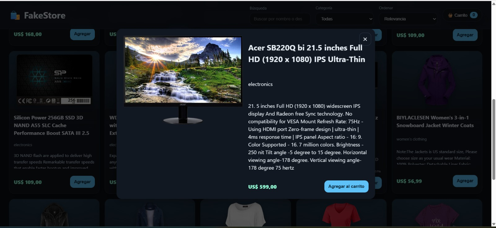

# 🛍️ FakeStore — Demo Completa

Aplicación web que consume la API pública [FakeStoreAPI](https://fakestoreapi.com/products), mostrando productos dinámicamente en el DOM y permitiendo al usuario gestionar un carrito de compras con persistencia en `localStorage`.

---

## ✨ Funcionalidades

- **Consumo de API**: se obtienen los productos y categorías desde la API con `fetch` y `async/await`.
- **Render dinámico**: los productos se representan como tarjetas con imagen, título, precio, categoría y descripción.
- **Carrito de compras**:
  - Agregar productos desde la tarjeta o desde el modal.
  - Incrementar / disminuir cantidad.
  - Eliminar productos o vaciar todo el carrito.
  - Cálculo automático del total.
  - Persistencia en `localStorage`.
- **Filtros y ordenamientos**:
  - Filtro por categoría.
  - Búsqueda por nombre o descripción.
  - Ordenar por precio (asc/desc) o por nombre (A–Z / Z–A).
- **Modal de detalle de producto** para ver información ampliada.
- **Diseño responsivo**: funciona en escritorio, tablet y móvil.
- **Accesibilidad**: etiquetas `aria-*`, botones con `aria-label`.

---

## 📷 Capturas de pantalla

### Vista principal


### Carrito lateral


### Modal de producto


---

## 🚀 Ejecución

1. Clonar este repositorio:
   ```bash
   git clone https://github.com/usuario/fakestore-app.git
